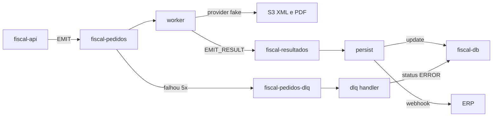
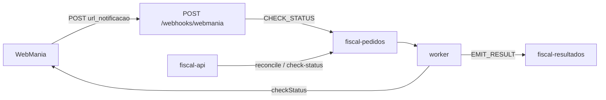

# MVP Fiscal (NF-e)

Monorepo do serviço fiscal **desacoplado do ERP**: emissão assíncrona via filas, persistência e webhook para projeção no ERP. Comportamento detalhado em [`spec.md`](spec.md); decisões de implementação em [`DECISIONS.md`](DECISIONS.md).

## O que roda aqui

| Processo | Papel |
|----------|--------|
| **fiscal-api** | REST (`/invoices`, emitentes, perfis), enfileira pedidos, callback público WebMania |
| **worker** | Consome `fiscal-pedidos`, chama provider (fake ou WebMania), grava XML/PDF no S3, publica resultados |
| **persist** | Consome `fiscal-resultados`, atualiza Postgres fiscal, dispara webhook HMAC para o ERP |
| **dlq handler** | Consome `fiscal-pedidos-dlq`, marca nota `ERROR` e notifica ERP |
| **erp** | Proxy de notas, produtos, lançamentos; recebe webhooks |
| **web** | UI mínima (Next.js) sobre a API do ERP |

Localmente, **FlocalStack** (Docker) simula S3/SQS; dois Postgres (fiscal `5433`, ERP `5432`).

## Arquitetura

Fluxo principal de emissão (MVP local com **provider fake**):



Extensões (WebMania / recuperação — já no código; fake simula callback):



- **ERP → fiscal-api**: cria nota (`202 PENDING`), idempotência por `Idempotency-Key`.
- **Worker** monta `url_notificacao` assinada (`?t=payload.hmac`) **em cada emissão**; só o worker fala com o provider.
- **Callback** valida HMAC, enfileira `CHECK_STATUS` (não grava banco); consulta real fica no worker.
- **Reconciliação** (`POST /admin/reconcile` ou job agendado): `PENDING` stale sem ref → re-`EMIT`; `PROCESSING` stale → `CHECK_STATUS` (nunca reemitir às cegas com `provider_ref`).

Estrutura do repo: `packages/contracts` (schemas/filas), `apps/fiscal`, `apps/erp`, `apps/web`.

---

## Instalação e primeiro uso (local)

### 1. Pré-requisitos

- **Node.js 20+**
- **pnpm 9** (`corepack enable` se necessário)
- **Docker Desktop** (Postgres + FlocalStack)

### 2. Clonar e instalar dependências

```bash
cd MVP-fiscal
pnpm install
```

O `postinstall` tenta gerar os clients Prisma; no Windows, se falhar com **EPERM**, pare processos que usam o fiscal (`pnpm dev`) e rode o passo 5.

### 3. Variáveis de ambiente

```bash
cp apps/fiscal/.env.example apps/fiscal/.env
cp apps/erp/.env.example apps/erp/.env
```

Mantenha `FISCAL_API_KEY` e `WEBHOOK_SECRET` **iguais** nos dois `.env` (dev: valores do example).

### 4. Infraestrutura e banco

```bash
pnpm infra:up
pnpm infra:init
pnpm db:migrate
pnpm seed
```

- `infra:init` cria bucket S3 e filas SQS no emulador (também feito no seed, mas convém rodar após subir o Docker).
- Migrações: fiscal (`0001` + `0002` com status `PROCESSING`) e ERP.

### 5. Prisma generate (se necessário)

```bash
pnpm --filter @fiscal-mvp/fiscal prisma:generate
pnpm --filter @fiscal-mvp/erp prisma:generate
```

### 6. Subir todos os serviços

```bash
pnpm dev
```

| URL | Serviço |
|-----|---------|
| http://localhost:3000 | ERP API |
| http://localhost:3100 | Fiscal API |
| http://localhost:3200 | Web UI |

Aguarde logs do worker/persist sem erro antes de emitir notas.

### 7. Validar

```bash
pnpm test
pnpm e2e
```

O e2e cobre emissão autorizada/rejeitada, idempotência, `[FAKE:PROCESSING]` (callback simulado → `AUTHORIZED`), webhook ERP e vínculo com lançamento.

### 8. Testes manuais rápidos

- UI: http://localhost:3200/notas/nova — emitir nota; detalhe mostra timeline e status.
- Tags no campo **informações adicionais** (fake): `[FAKE:REJECT]`, `[FAKE:SLOW]`, `[FAKE:PROCESSING]`, `[FAKE:ERROR]` (vai para DLQ após retries).
- Reconciliação: `POST http://localhost:3100/admin/reconcile` com headers `x-api-key` e `x-workspace-id` (ver seed em `packages/contracts`).

---

## Configuração adicional (produção)

Ambiente real na AWS (resumo; detalhes em `spec.md` §20–21):

| Componente | Onde roda | Observação |
|------------|-----------|------------|
| fiscal-api, persist, dlq | Lambda **na VPC** | RDS Postgres; SQS via VPC endpoint |
| worker | Lambda **fora da VPC** | Internet para WebMania; credenciais no SSM/Secrets Manager |
| callback `/webhooks/webmania` | Lambda/API Gateway **fora da VPC** | Só valida token e envia `CHECK_STATUS` ao SQS |
| ERP | Seu stack | `FISCAL_API_URL` apontando para API fiscal |

### Variáveis (fiscal)

| Variável | Local | Produção |
|----------|-------|----------|
| `DATABASE_URL` | Postgres Docker `:5433` | RDS (VPC) |
| `AWS_*`, `S3_*`, `SQS_*` | FlocalStack `:4566` | Conta AWS real (sem `AWS_ENDPOINT_URL` ou endpoint regional) |
| `FISCAL_PROVIDER` | `fake` | `webmania` |
| `FISCAL_API_KEY` | dev | Segredo forte; ERP envia `x-api-key` |
| `ERP_WEBHOOK_URL` | `http://localhost:3000/fiscal/webhook` | URL pública HTTPS do ERP |
| `WEBHOOK_SECRET` | dev | HMAC compartilhado fiscal → ERP |
| `WEBMANIA_CALLBACK_BASE_URL` | `http://localhost:3100` | URL **pública** do callback (uma base para todos os CNPJs/workspaces) |
| `WEBMANIA_CALLBACK_SECRET` | dev | Segredo para assinar `?t=` por nota |
| `PENDING_STALE_SECONDS` / `PROCESSING_STALE_SECONDS` | `120` | Ajustar + job `reconcile` agendado (EventBridge) |
| `PRESIGN_MODE` | `url` | `url` com TTL curto ou `stream` conforme política |

### Variáveis (ERP)

| Variável | Descrição |
|----------|-----------|
| `FISCAL_API_URL` | Base da API fiscal |
| `FISCAL_API_KEY` | Mesmo valor do fiscal |
| `WEBHOOK_SECRET` | Validar `x-fiscal-signature` |
| `DATABASE_URL` | Postgres ERP |

### WebMania

- Enviar **`url_notificacao` em cada emissão** (worker já monta URL com token HMAC).
- Liberar **IPs de saída** da WebMania no firewall do callback.
- Homologação na máquina local: **ngrok/cloudflared** apontando para o callback; senão use polling/reconcile.
- Confirmar com o suporte: assinatura do callback, reenvios e API de consulta por `uuid`.
- **Reconciliação agendada permanece obrigatória**; callback só acelera.

### Operacional

- Alarmes: notas `PENDING`/`PROCESSING` acima de N minutos; mensagens na DLQ.
- Rotacionar `FISCAL_API_KEY`, `WEBHOOK_SECRET`, `WEBMANIA_CALLBACK_SECRET` com janela de overlap.
- Staging na AWS real antes de produção (emulador FlocalStack não cobre 100% do comportamento SQS/S3).

---

## Problemas comuns (Windows)

| Sintoma | Ação |
|---------|------|
| `EPERM` no `prisma generate` | Pare `pnpm dev` e rode `pnpm --filter @fiscal-mvp/fiscal prisma:generate` |
| e2e 500 no `AuthGuard` | Reinicie `pnpm dev` após pull (guard usa `Reflector` estático por limitação do `tsx`) |
| Nota presa em `PENDING` | Verifique worker/persist; `POST /admin/reconcile` |
| `[FAKE:PROCESSING]` não avança | API fiscal deve estar no ar (callback POST em `WEBMANIA_CALLBACK_BASE_URL`) |

---

## Scripts úteis

```bash
pnpm infra:down          # derruba Docker
pnpm dev:fiscal:api      # só API fiscal (debug)
pnpm --filter @fiscal-mvp/fiscal prisma:migrate  # nova migração (dev)
```

Documentação completa de API, filas e fases: [`spec.md`](spec.md). 
